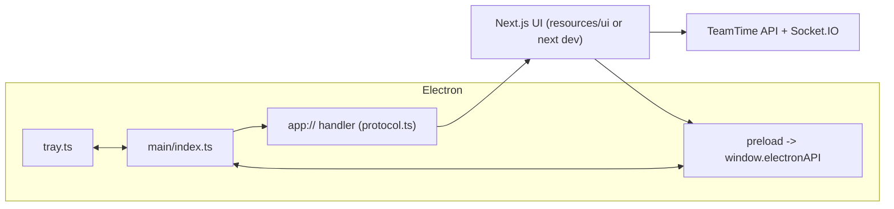

# Technical Architecture

Feature: TeamTime desktop app (Electron)
Status: approved

## Shape

Electron main process + sandboxed preload. The renderer is the Next.js frontend,
either a static export (`output: "export"`, built with `ELECTRON_BUILD=1`) or a
running dev server.

## Key decisions

- **Custom `app://teamtime` scheme, not `file://`.** Gives a stable origin so
  absolute `/_next/...` paths resolve and CORS can allow exactly one origin.
  Registered privileged (`standard`, `secure`, `supportFetchAPI`, `corsEnabled`).
- **Handler lives on the window's session** (`persist:comm-desktop`).
  `protocol.handle` on the global object only covers the default session; the
  window's partition would abort every load. `SESSION_PARTITION` is the single
  constant for window, permissions and handler.
- **Config before render.** `ensureDesktopConfig()` is one memoized promise.
  The axios request interceptor awaits it, and `(app)/layout.tsx` does not render
  (and so does not open the shared socket) until it resolves.
- **Navigation from the shell** (`app:navigate`) is handled in the root-level
  `DesktopTitleBar`, not `AppShell`, so it works while signed out. The auth
  guard keeps the query string in `next`.
- **Preload listeners return unsubscribe functions**; the previous preload only
  ever added listeners.
- **Static export skips type-check** (`typescript.ignoreBuildErrors` in the
  `ELECTRON_BUILD` config only) because `build-ui.mjs` parks `src/app/api` and
  generated route types still reference it. `tsc --noEmit` covers the code.

## IPC surface

`window:*` (min/max/close), `desktop:getConfig`, `notification:send` (with
`url`), `tray:setStatus` / `tray:statusChanged`, `app:setUnreadCount`,
`app:navigate`, `app:force-end-call`, `desktop:getLoginItem` / `setLoginItem`.
Types mirrored in `frontend/src/lib/desktopRuntime.ts`.
