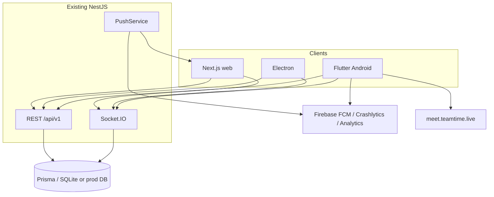
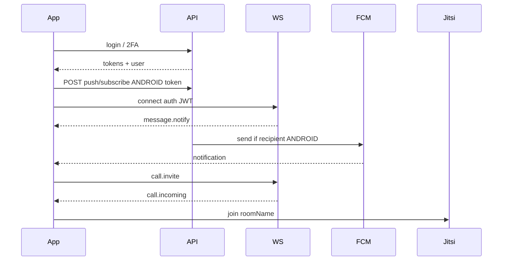

# Technical Architecture

Feature: Flutter Android client for TeamTime  
Status: approved

## System context

Flutter Android app is another client of the existing TeamTime backend. Firebase Cloud Messaging, Crashlytics, and Analytics sit beside the API. Jitsi hosting stays at `meet.teamtime.live`. Web VAPID push remains for browsers.

## Technology stack and rationale

| Layer | Choice | Why |
|---|---|---|
| Client | Flutter, Dart 3, Android minSdk 24 | User-selected; Jitsi SDK requires 24 |
| State | Riverpod | Testable; no server cache in ad-hoc singletons |
| Networking | Dio + existing JWT refresh pattern | Matches web interceptor behavior |
| Realtime | `socket_io_client` | Same event names as web (`message.sent`, `call.incoming`, …) |
| Local session | `flutter_secure_storage` | Tokens must not sit in plain SharedPreferences |
| Calls | `jitsi_meet_flutter_sdk` | Official SDK; same server as web; **minSdk 26** |
| Push/crash/analytics | Firebase (`firebase_core`, `firebase_messaging`, `firebase_crashlytics`, `firebase_analytics`) | Approved option A |
| Backend FCM | `firebase-admin` in Nest PushService | Send by `deviceType` |

Not used: Firebase Auth, Firestore, Realtime Database, Flutter WebView for product UI.

## Component and service boundaries

Repo layout:

- `mobile/` — Flutter app (new)
- `backend/` — add FCM send + subscribe DTO for Android tokens; CORS/env
- `frontend/` / `desktop/` — unchanged except optional shared docs

Flutter layers:

- `lib/app/` — MaterialApp, router, theme
- `lib/core/` — env, secure storage, Dio, socket, errors
- `lib/features/<feature>/` — data / domain / presentation (auth, home, teams, dms, calls, activity, files, people, settings)
- `lib/services/` — API DTOs mirroring `frontend/src/services/api.ts` (not a copy-paste of JS)

UI widgets stay dumb; hooks/notifiers own logic (same spirit as web: screens ≠ business logic).

## Data model and storage

- Server remains Prisma. App does not replicate workspace DB.
- Local only: access token, refresh token, session id, cached user JSON, FCM token, API base URL override (debug).
- Message lists: in-memory + optional light disk cache for last conversation (nice-to-have; not required for v1 exit).

Device (existing):

- `deviceType`: `WEB` | `ANDROID` (v1) | `IOS` (later)
- `pushToken`: unique. Web = JSON string of PushSubscription. Android = FCM registration token string.

## API contracts

Reuse existing REST. Add or extend:

- `POST /api/v1/notifications/push/subscribe`  
  - Web: `{ subscription: PushSubscription, deviceType: "WEB" }` (current)  
  - Android: `{ token: string, deviceType: "ANDROID" }`  
  Keep web body working.
- `DELETE /api/v1/notifications/push/subscribe` accepts `{ token }` or `{ subscription }`.
- `PushService.sendToUsers`: if token parses as JSON object → VAPID; else FCM data/notification payload `{ title, body, url }`.

Socket events: same as `frontend` (`room.join`, `message.notify`, `call.*`, `user.presence`, `user.typing`, `receipt.*`). Do not invent `message:new`.

Jitsi: room naming must use the same helper as `frontend/src/lib/callRoom.ts`.

## External integrations

- Firebase project: Android app id `live.teamtime.app`
- FCM server: backend env `FIREBASE_PROJECT_ID` + service account JSON path or `GOOGLE_APPLICATION_CREDENTIALS` (never commit the JSON)
- Jitsi: `https://meet.teamtime.live` (overridable)
- Cloudinary/local uploads: unchanged file API

## Authentication and authorization

- Same JWT access + refresh + session id as web.
- 2FA challenge `needsTwoFactor` + `verifyKey` unchanged.
- Nav/capabilities from stored user (`allowedNavKeys`, `capabilities`) via `lib/permissions` port.
- No Firebase Authentication.

## Security and privacy

- TLS for release API.
- Certificate pinning not required in v1.
- Analytics events: screen names only, no message bodies, emails, or tokens.
- Clear secure storage on logout.
- Backend still rate-limits auth.

## Performance and scalability

- Paginate messages as web does.
- One socket per logged-in session.
- FCM fan-out stays per-device in PushService (same scale as current VAPID loop).

## Observability

- Crashlytics: Flutter errors + native.
- Backend: existing Nest logs; log FCM failures without token values.
- Analytics: `login_success`, `call_join`, tab views.

## Deployment and environments

| Flavor | API default | Socket |
|---|---|---|
| debug | `http://10.0.2.2:5000` | same origin/path as web socket |
| profile/release | `https://communication.impmeet.com` | same host |

Physical device debug: developer setting for LAN base URL.

`google-services.json` lives in `mobile/android/app/` and is documented; do not put private keys in git if the team treats the file as secret.

## Testing strategy

- Unit: token refresh, room name, permission gating, push payload routing (backend).
- Widget: login form, composer, incoming call buttons.
- Manual: two-emulator chat + call (verification phases).

## Architectural decisions and consequences

| Decision | Consequence |
|---|---|
| Nest is source of truth | Mobile never writes workspace data only to Firebase |
| FCM beside VAPID | PushService must branch on token shape/`deviceType` |
| Native Jitsi SDK | minSdk 24, larger APK, manifest merge rules |
| Android only | iOS folders may exist from Flutter create but are out of v1 QA |
| Sign-in only | No register screens |

## Diagrams

