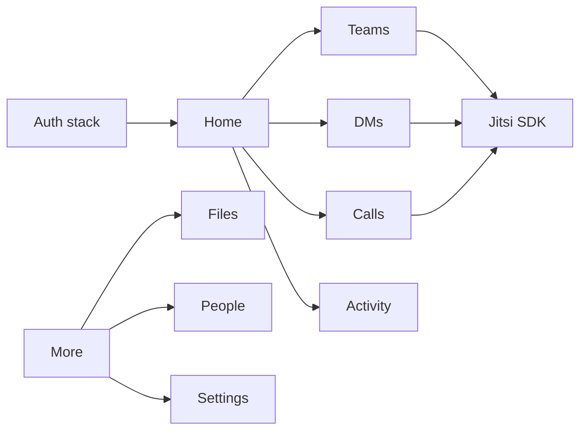

# Product Design

Feature: Flutter Android client for TeamTime  
Status: approved

## Design principles

- Phone-first. One primary column. Bottom navigation for member modules.
- Same information hierarchy as web AppShell, not a clone of desktop density.
- Chat is the hero: composer always reachable; message actions via long-press sheet.
- Native platform patterns (Material 3) with TeamTime color accents from web.
- Offline: show last known lists; never fake send success.

## User journeys and flows

1. **Cold start** → splash → session? Home : Login.
2. **Login** → optional 2FA → Home.
3. **Forgot password** → email submitted → copy explains link arrives in email (web reset URL).
4. **Team chat** → pick team → channel → thread optional → composer.
5. **Incoming call (foreground)** → full-screen incoming → accept (Jitsi) / decline.
6. **Incoming call (background)** → FCM → tap opens incoming or join path.
7. **People → DM** → existing or created direct conversation.

## Information architecture

Bottom nav (gated by `allowedNavKeys`): Home, Teams, Chat, Calls, Activity. Overflow/More: Files, People, Settings.

Auth stack (no bottom nav): Login, 2FA, Forgot password, Reset password (token).

## Screens and states

| Screen | Empty | Loading | Error | Success |
|---|---|---|---|---|
| Login | form | submitting | inline API message | navigate Home |
| 2FA | code field | verifying | invalid/expired | Home |
| Home | zero widgets | skeletons | retry | dashboard cards |
| Teams list | no channels | list shimmer | retry | grouped teams |
| Chat thread | no messages | pagination spinner | banner | bubbles + composer |
| Calls | no history | shimmer | retry | list + start |
| Incoming call | — | connecting | failed to join | Jitsi |
| Activity | caught up | shimmer | retry | grouped notifications |
| Files | no files | shimmer | retry | list + upload FAB |
| People | no matches | shimmer | retry | directory |
| Settings | — | saving | inline | profile saved |

## Interaction behavior

- Pull-to-refresh on lists.
- Composer: text, attach, mention picker (`@`), send. Poll/task via `+` sheet.
- Long-press message → edit/delete/forward/star/pin/react.
- Back: thread → channel → teams; Jitsi back leaves meeting only via hang up (SDK UI).
- Availability change updates local user and `setTrayStatus` equivalent is FCM/presence only (no tray).

## Responsive behavior

- Target 360–428dp width. Tablets: same nav, slightly wider bubbles (max 560dp).
- Keyboard: composer pads with viewInsets; lists resize.

## Accessibility

- Semantic labels on nav and composer actions.
- Contrast AA for text on surfaces.
- Dynamic type: scale up to 1.3 without clipping send button.
- TalkBack: message actions announced from the sheet, not hidden in swipe-only gestures.

## Visual direction

Material 3, light surface first (match web `slate` + blue accents). Dark mode not required in v1.

## Design system

### Colors

- Primary: `#0284c7` (web Home/chat accent)
- Surface: `#f8fafc` / cards `#ffffff`
- Text: `#020617` / muted `#64748b`
- Danger: `#e11d48`
- Success: `#059669`
- Call green: `#10b981`

### Typography scale

- Display: 22/28 semibold (screen titles)
- Title: 16/24 semibold
- Body: 14/20 regular
- Meta: 12/16 medium

Use a geometric sans close to web Poppins (e.g. `google_fonts` Poppins).

### Spacing

4 / 8 / 12 / 16 / 24 / 32. Screen horizontal padding 16.

### Radii

Cards 18–20, buttons stadium (full pill), squircle badges 20–22, composer 28, text fields 20.

### Shadows

Single soft card elevation (`Color(0x0A000000)` blur 8–10). White pill buttons have soft drop shadow (`Color(0x1A000000)` blur 12–14, offset (0, 4)).

### Icons

Material Symbols rounded. Clean 20–24dp iconography inside squircles and inputs.

### Components and variants

- `TtButton`:
  - `primary`: white pill (`StadiumBorder`), dark slate text (`#0F172A`), soft drop shadow
  - `secondary` / `glass`: translucent pill (`Color(0x2EFFFFFF)`), 1.2px white border, white text
  - `filled`: electric blue pill (`#0284C7`), white text
  - `destructive`: crimson pill (`#E11D48`), white text
- `TtSquircleBadge`: white squircle container (radius 20–22) with soft drop shadow
- `TtGlassCard`: translucent frosted card (radius 20) with subtle stroke
- `TtAvatar`: initials + network image with squircle / circle options
- `ChatComposer`: floating capsule bar with circular action triggers
- `IncomingCallOverlay`: full-screen call banner with stadium action buttons
- `EmptyState`: squircle inbox badge + stadium retry button

### Interactive states

Pressed scale 0.98; disabled 50% opacity; focus visible for TalkBack.

## Diagrams

