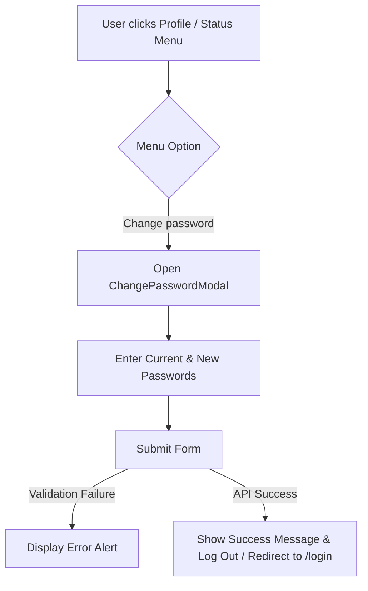

# Change Password Modal Design

**Date:** 2026-08-09  
**Status:** Approved  
**Scope:** Frontend (Next.js)

---

## 1. Overview

Users need a quick, accessible way to change their password directly from the user profile options in the navigation shell without navigating to the workspace settings page. The password change form will be removed from the Settings page and encapsulated into a dedicated modal component opened from the profile dropdowns.

---

## 2. Architecture & Component Design

### 2.1 `ChangePasswordModal` Component
**Location:** `frontend/src/app/components/ChangePasswordModal.tsx`

* **Props:**
  * `isOpen: boolean`
  * `onClose: () => void`
* **Features:**
  * Rendered via `Portal` to mount directly onto document body with backdrop blur and overlay click-to-close.
  * Inputs for:
    * Current password (`current-password` autocomplete)
    * New password (`new-password` autocomplete, minLength 8)
    * Confirm new password (`new-password` autocomplete)
  * Uses existing `PasswordInput` component with eye/eye-off toggle.
  * Client-side validation:
    * Required field checks
    * Minimum 8 characters for new password
    * New password matching confirmation password
    * New password different from current password
  * Backend Integration:
    * Calls `authAPI.changePassword({ currentPassword, newPassword })`
    * Handles errors gracefully (extracting API error response messages)
    * Displays success notification
    * Clears auth credentials (`veloce_token`, `veloce_refresh`, `veloce_session`, `veloce_user`), resets `useChatStore.getState().logout()`, and redirects to `/login?notice=password-updated`.

### 2.2 Shell Integration (`AppShell.tsx`)
**Location:** `frontend/src/app/components/AppShell.tsx`

* Maintain `showPasswordModal` state.
* Sidebar user popup "Change password" button opens `ChangePasswordModal`.
* Top-right profile dropdown "Change password" button opens `ChangePasswordModal`.
* Render `<ChangePasswordModal isOpen={showPasswordModal} onClose={() => setShowPasswordModal(false)} />`.

### 2.3 Settings Page Refactoring (`settings/page.tsx`)
**Location:** `frontend/src/app/(app)/settings/page.tsx`

* Remove the password form section and unused state hooks (`currentPassword`, `newPassword`, `confirmPassword`, `passwordError`, `passwordSuccess`, `savingPassword`, `handleChangePassword`).
* Clean up unused imports (`PasswordInput`, `Lock` if unused).
* Update header description and non-admin fallback view to reflect that workspace settings are managed by administrators.

---

## 3. User Flow

---

## 4. Verification & Testing

* Verify modal opens when clicking "Change password" from sidebar user status dropdown.
* Verify modal opens when clicking "Change password" from top-right header profile dropdown.
* Verify validation errors trigger on empty inputs, mismatched passwords, or weak passwords.
* Verify password change API submission works properly and invalid current passwords display backend error message.
* Verify `/settings` page renders cleanly without the old password change form for both admin and standard users.
